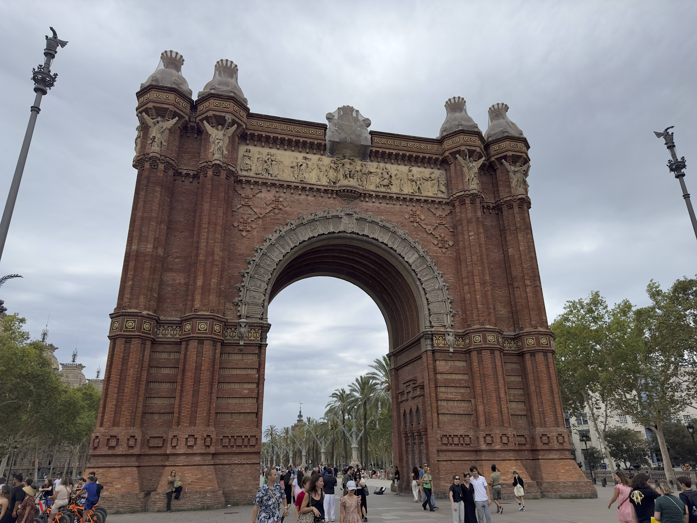
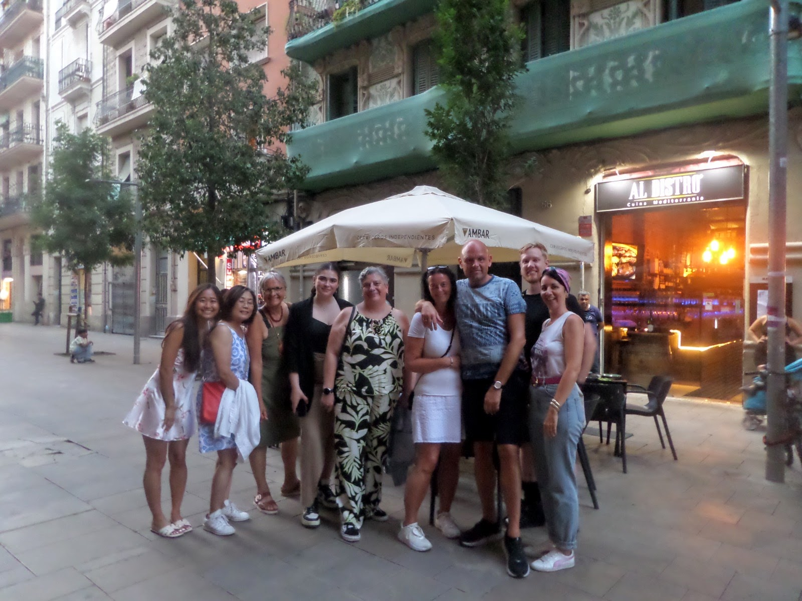

## Summary

Barcelona is a city rich in culture with expansive and inticrate  architecture. 

## Sagrada Família

One of the most recognizable and largest pieces of architecture. This church was designed by Antoni Guadi. He is well known through Barcelona for designing many buildings. His design style is seen by many as modernistic and ahead of his time.

The sheer size and scale of this church cannot be understated. One thing that stood out to me was the intricate engravings and sculptures around the outside of the building. There are three facades to the church, each with a different purpose. These are enclosed by several towers which reach up to the heavens. 

Despite the size and extravence, the church is actually still under construction. There are several more towers still to building, including the largest one which will be dedicated to Jesus.

> Sagrada Família

> Arc de Triomf

> Parc de la Ciutadella

> Tapas Group

> Casa Batlló

_stay #_
