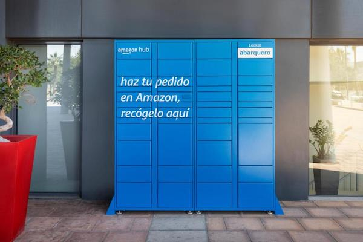
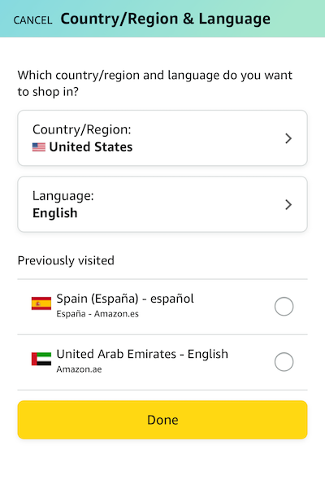

## Summary

We use Amazon almost on a daily basis in the States. Is it as easy and accessible overseas? Let's find out.

## Which Amazon?

If you log in to Amazon.com you'll be able to ship items to another country, however, this will ship items from the US to that country, which is not what you want.

Instead, Amazon offers different versions of its site and app for different countries. Navigate to the [country selection page](https://www.amazon.com/customer-preferences/country) and choose the appropriate country.

I'd recommend using the website as you can use the translation services of the browser to help navigate it. Once on there, you'll be able to purchase items as normal. Although I found the selection lacking compared to the US.

## Placing an order

Once you're ready to check out the process is similar to what you're used to. Add the item to the cart, your payment methods will transfer, and purchase the item. Unless you have a location you'll be at for some time, and you trust for deliveries, I'd recommend shipping to an Amazon Locker instead.

> A quick side note: features like your Prime membership don't transfer between countries. However, I found the shipping times to be quite fast even without Prime.

## Picking up the order

If you chose to use an Amazon Locker, like I did, then there will be some extra work to pick up the package.

First, you'll need to use the app to pick up the package. Not only that, but you will need to use the app in the country you ordered from. You can change this within the app by navigating to the **Settings** and changing your country.

When you receive the email from Amazon that your package has been delivered click the link to open the app. It's pretty intuitive without translation, but I've outlined the basic steps below:

1. Make sure bluetooth is enabled
2. Open the link in the email
3. Stand close to the locker
4. Follow the prompts to open the locker

## Would I recommend it?

Yes, if there is something you need that can't be easily purchased from a nearby shop, then Amazon is a great choice. I'd recommend just using the free shipping as in my experience packages arrived quite quickly. I'd also recommend using an Amazon Locker as it's secure and easy to access.

_stay #_
